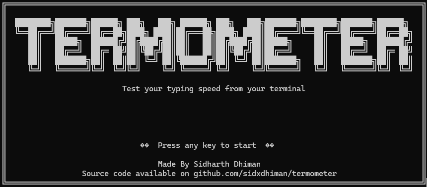
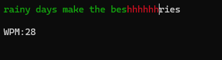
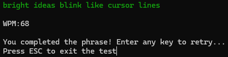

# TERMOMETER ⌨️  
A fast-paced terminal-based typing speed test built with Python and `curses`.

## Releases:
- v1.0

## 🔽 Download
➡️ [Download Termometer .exe](https://github.com/sidxdhiman/termometer/releases/latest)

## 🚀 Features
- Retro-style terminal UI
- WPM (Words Per Minute) counter
- Color-coded feedback for correct and incorrect characters
- Random phrase selection from `phrases.txt`
- Start screen with stylized ASCII art from `welcome.txt`

## Screenshots

## 📦 Requirements
- Python 3.8+
- Compatible with Windows, macOS, and Linux
- Uses the built-in `curses` module (use `windows-curses` if you're on Windows)

## 🛠️ To Run this application follow these steps:

1. Clone this repo:

        git clone git@github.com:sidxdhiman/termometer.git
        cd termometer

2. Install dependencies (Windows only):

        pip install windows-curses

3. Make sure you have(the application will not run without it):

    phrases.txt → contains all typing sentences

    welcome.txt → contains your ASCII welcome screen

4. Run it

       python app.py

5. If you want to make .exe file :

       pyinstaller --onefile --add-data "welcome.txt;." --add-data "phrases.txt;." app.py       

## Made By Sidharth Dhiman
   
